# Full Stack Lab: Node.js, Express, MongoDB & REST APIs

This repository contains 15 experiments. Click any index item to jump to that experiment's section. Each section includes a short description, run steps, expected output, a screenshot placeholder, and JSON examples for testing.

Index (click to jump)

- [Experiment 1](#exp1) - Hello World
- [Experiment 2](#exp2) - Basic HTTP server
- [Experiment 3](#exp3) - Test GET/POST (Postman)
- [Experiment 4](#exp4) - Express CRUD (books)
- [Experiment 5](#exp5) - Middleware (logging & json)
- [Experiment 6](#exp6) - Mongoose connection
- [Experiment 7](#exp7) - Mongoose schema & insert
- [Experiment 8](#exp8) - CRUD with Express + Mongoose
- [Experiment 9](#exp9) - Status codes & error handling
- [Experiment 10](#exp10) - Mongoose validation
- [Experiment 11](#exp11) - User registration (bcrypt)
- [Experiment 12](#exp12) - JWT auth (protected routes)
- [Experiment 13](#exp13) - Role-based authorization
- [Experiment 14](#exp14) - Pagination / filtering / sorting
- [Experiment 15](#exp15) - File upload (multer) & rate limiting

---

<a id="exp1"></a>

## Experiment 1: Install Node.js and npm, Hello World (CO1)

Description: Install Node.js & npm and run a simple script.

Run:

- node exp1.js

Expected:

- Console shows "Hello World"

Outputs:
<br></br>
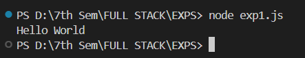

Testing JSON:

- Not applicable (console script).

---

<a id="exp2"></a>

## Experiment 2: Basic Node.js HTTP server (CO1)

Description: Simple HTTP server that responds "Hello REST API" on GET /.

Run:

- node exp2.js (or server file)

Expected:

- Browser: "Hello REST API" at http://localhost:3000

Outputs:
<br></br>
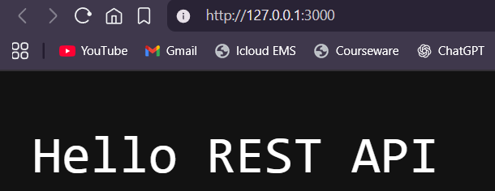

Testing JSON:

- Not applicable (GET text response).

---

<a id="exp3"></a>

## Experiment 3: Test GET and POST with Postman (CO1)

Description: Native http server with GET /api/get-data and POST /api/post-data.

Run:

- node exp3.js

Expected:

- GET returns 200 JSON; POST returns 201 on valid JSON.

Outputs:
<br></br>
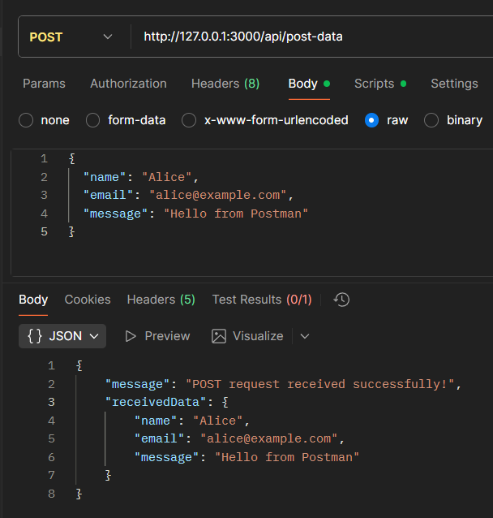
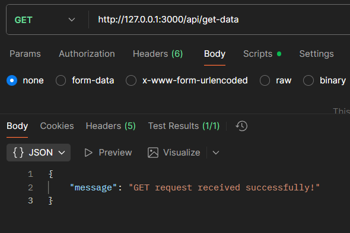
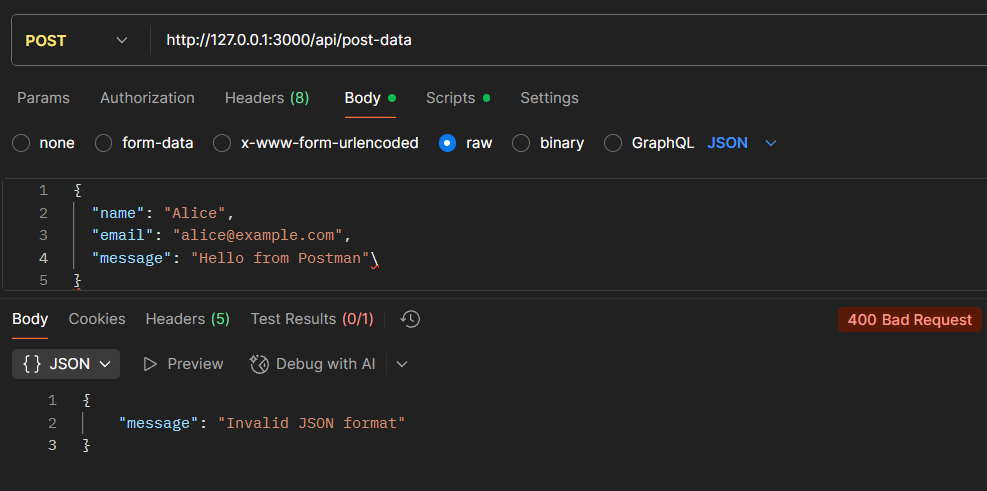

Example requests:

GET

- GET http://127.0.0.1:3000/api/get-data

POST JSON (body)

```json
{
  "name": "Alice",
  "email": "alice@example.com",
  "message": "Hello from Postman"
}
```

Expected POST responses:

- 201 Created with received data on success
- 400 Bad Request for malformed JSON

---

<a id="exp4"></a>

## Experiment 4: ExpressJS app with CRUD routes (CO2)

Description: Express app with in-memory books array. File: exp4.js

Run:

- node exp4.js

Endpoints:

- GET /api/books
- GET /api/books/:id
- POST /api/books
- PUT /api/books/:id
- DELETE /api/books/:id

Outputs:
<br></br>
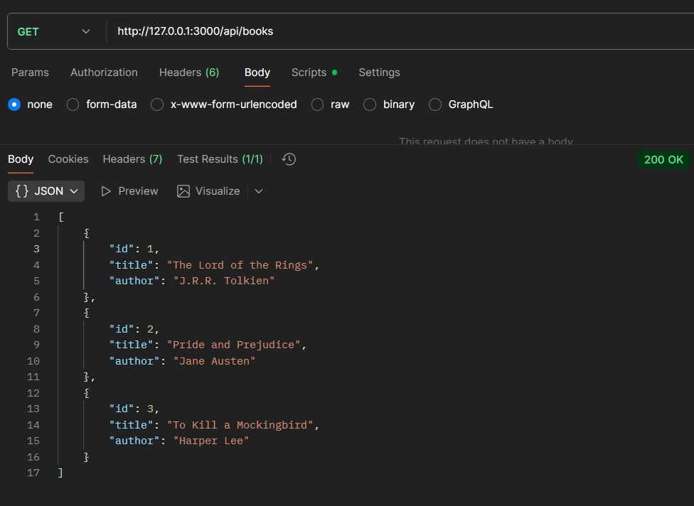
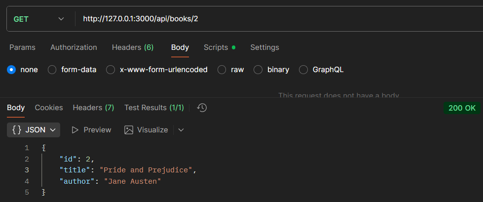
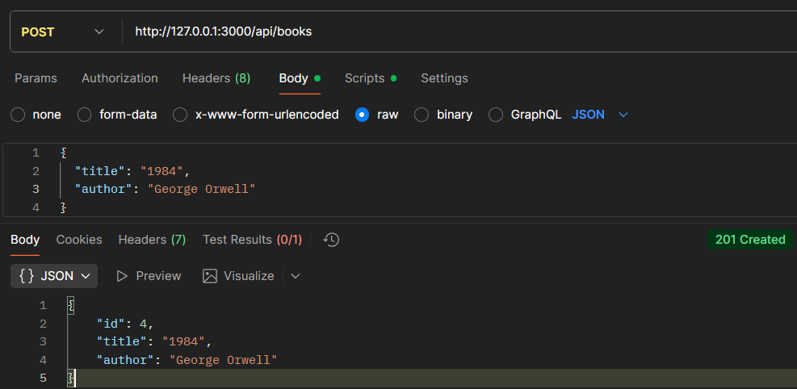
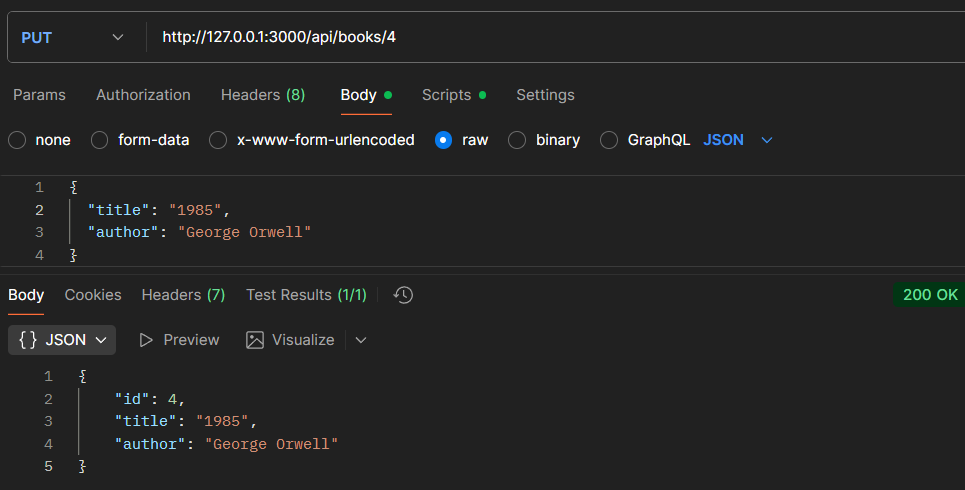
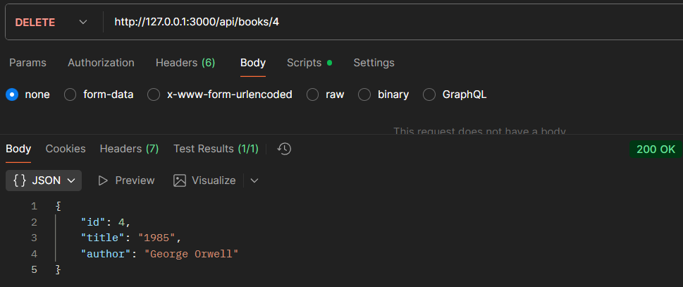

Sample JSON for testing:

Create (POST /api/books)

```json
{
  "title": "1984",
  "author": "George Orwell"
}
```

Update (PUT /api/books/1)

```json
{
  "title": "The Lord of the Rings - Updated"
}
```

Responses:

- 200 OK for GET/PUT/DELETE, 201 Created for POST, 404 Not Found if id missing.

---

<a id="exp5"></a>

## Experiment 5: Express middleware (logging & JSON parsing) (CO2)

Description: Demonstrates express.json() and request logging (morgan or custom logger).

Run:

- Start the related server (e.g., exp4.js) after adding middleware.

Example middleware usage:

```js
app.use(express.json());
app.use(require("morgan")("dev"));
```

Outputs:
<br></br>
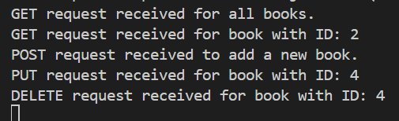

Test JSON (example POST to any JSON endpoint)

```json
{
  "sample": "data",
  "number": 123
}
```

---

<a id="exp6"></a>

## Experiment 6: Connect Node.js to MongoDB with Mongoose (CO3)

Description: Connect to MongoDB (local/Atlas) using mongoose.

Run:

- Ensure MongoDB running, then start the server that calls mongoose.connect (e.g., exp14.js or exp15.js).

Expected:

- Console prints "MongoDB connected"

Outputs:
<br></br>
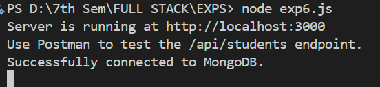

Test connection JSON:

- Not applicable. Use console logs to validate connection.

---

<a id="exp7"></a>

## Experiment 7: Mongoose schema and insert records (CO3)

Description: models/Product.js defines product schema. Insert records via route or script.

Run:

- Start server with mongoose connected and POST to /api/products (exp14 setup).

Sample JSON (POST /api/products)

```json
{
  "name": "NodeJS Guide",
  "category": "books",
  "price": 199
}
```

Outputs:
<br></br>
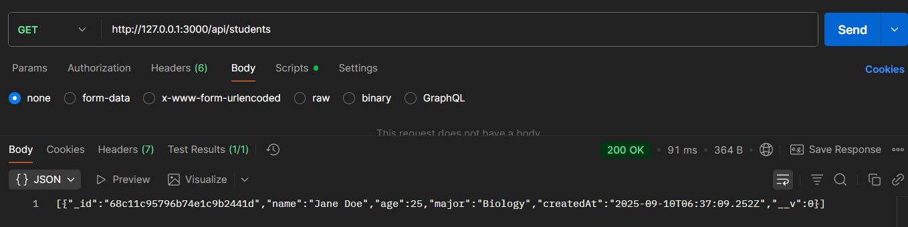
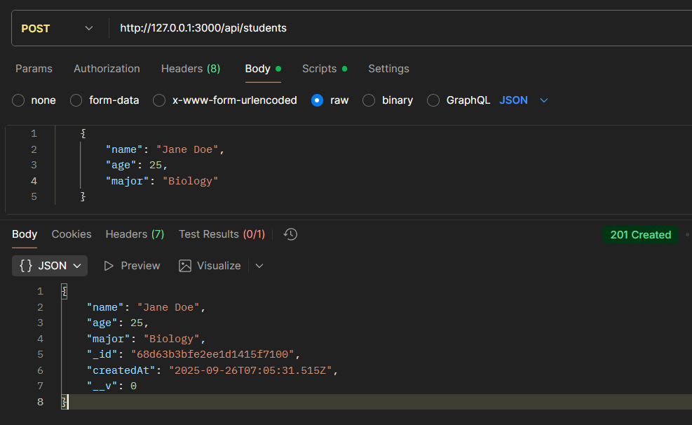
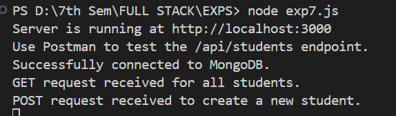

Expected:

- 201 Created with saved document including \_id and createdAt.

---

<a id="exp8"></a>

## Experiment 8: Full CRUD REST API with Express + Mongoose (CO3)

Description: CRUD endpoints backed by Mongoose models.

Run:

- Start server (exp14.js for products or other server files).

Sample JSON:

Create student/product

```json
{
  "name": "John Doe",
  "email": "john@example.com",
  "age": 21
}
```

Expected:

- 201 on create, 200 on read/update/delete, 404 when not found.

Outputs:
<br></br>


---

<a id="exp9"></a>

## Experiment 9: Status codes and error handling (CO3, CO6)

Description: Centralized error handler in Express returns appropriate codes.

Run:

- Start server; trigger validation or not-found routes.

Sample error JSON (client receives)

```json
{
  "error": "ValidationError: name is required"
}
```

Outputs:
<br></br>
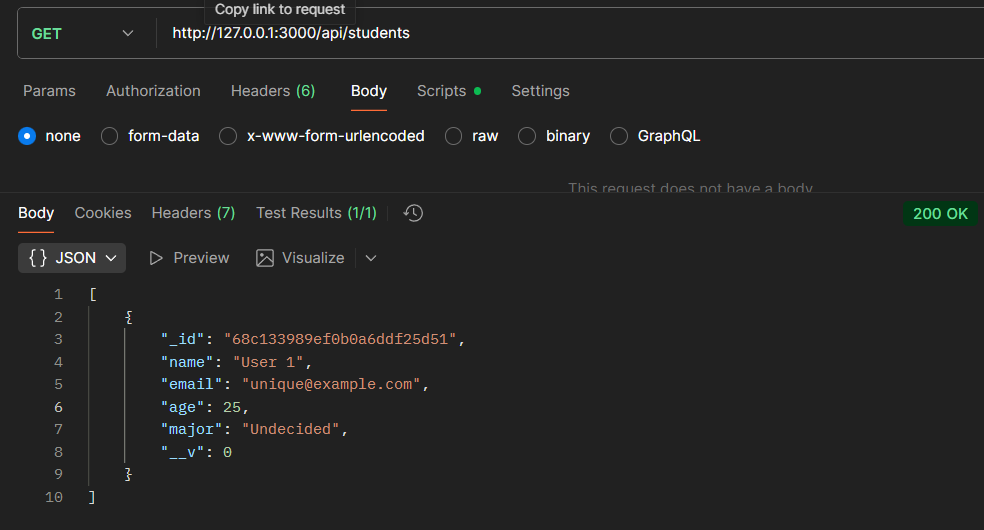


Expected:

- 400 for validation, 404 for not found, 500 for server errors.

---

<a id="exp10"></a>

## Experiment 10: Mongoose schema validation (CO3, CO6)

Description: Add required, match, min/max validations on schemas.

Example schema snippet (conceptual)

```js
email: { type: String, required: true, match: /.+\@.+\..+/ }
```

Test JSON (invalid -> triggers validation)

```json
{
  "name": "",
  "email": "invalid-email"
}
```

Outputs:
<br></br>
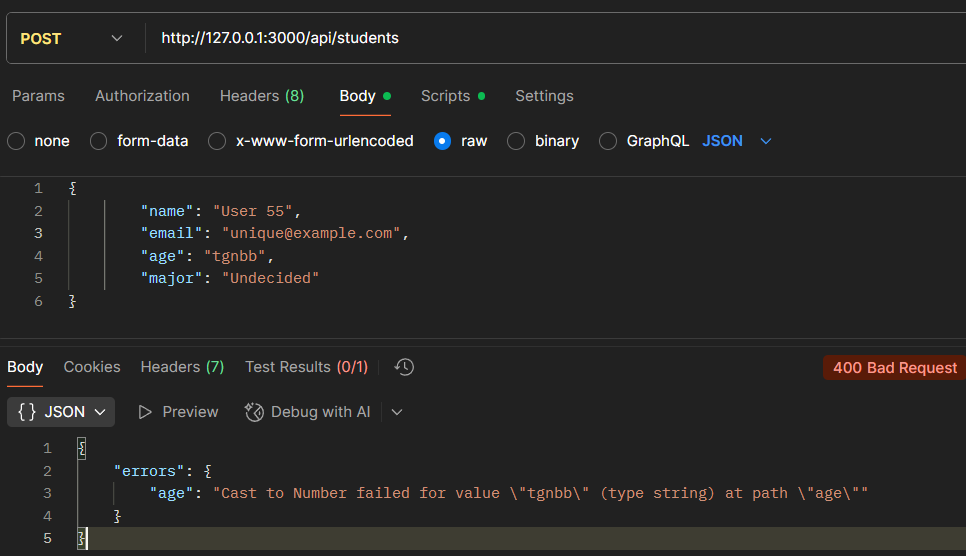
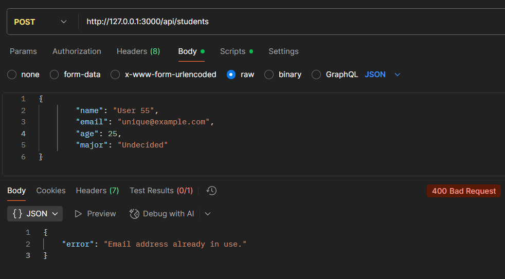

Expected:

- Mongoose ValidationError -> respond 400 with details.

---

<a id="exp11"></a>

## Experiment 11: User registration & bcrypt hashing (CO4)

Description: Register users and store hashed passwords.

Sample registration JSON (POST /api/auth/register)

```json
{
  "name": "Alice",
  "email": "alice@example.com",
  "password": "P@ssw0rd!"
}
```

Expected:

- Stored user with hashed password (not plaintext).

Outputs:
<br></br>
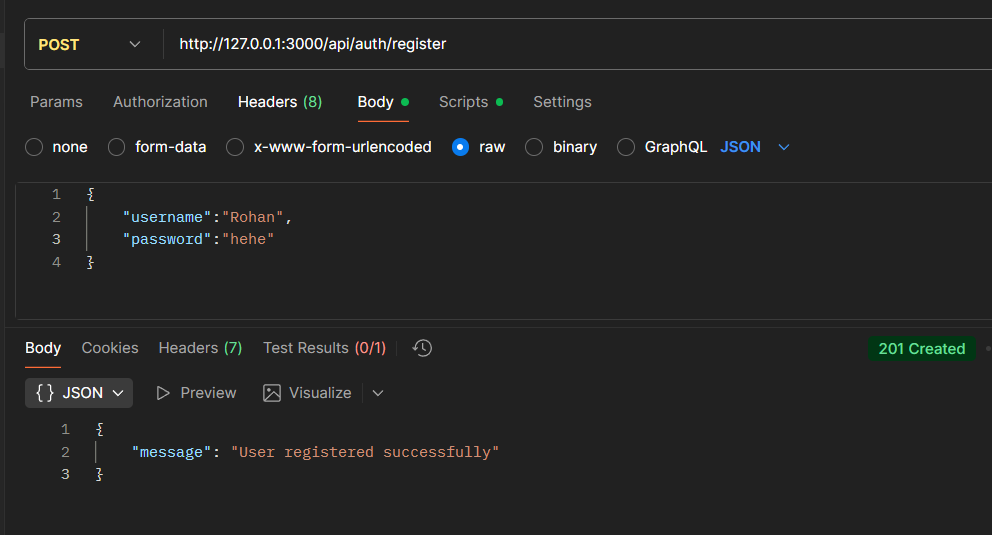
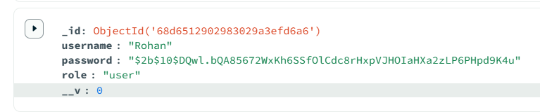
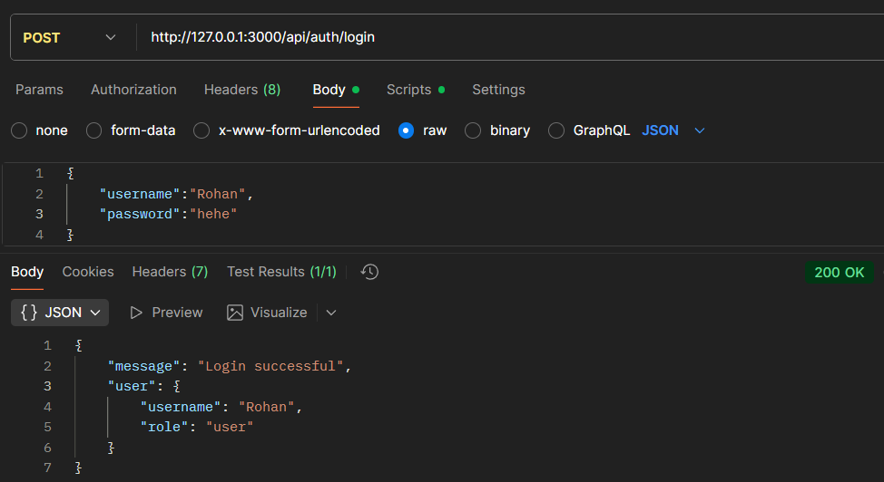


---

<a id="exp12"></a>

## Experiment 12: JWT authentication for protected routes (CO4)

Description: Login issues JWT; middleware verifies Authorization header.

Login JSON (POST /api/auth/login)

```json
{
  "email": "alice@example.com",
  "password": "P@ssw0rd!"
}
```

On success:

- Response contains token:

```json
{ "token": "eyJhbGciOi..." }
```

Use header for protected requests:

- Authorization: Bearer <token>

Outputs:
<br></br>
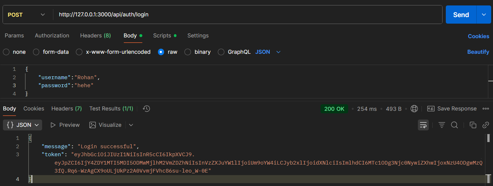

Expected:

- 401 for missing/invalid tokens, 200 for valid.

---

<a id="exp13"></a>

## Experiment 13: Role-based authorization (Admin vs User) (CO4)

Description: Add role to users and enforce endpoints by role.

Create admin user JSON

```json
{
  "name": "Admin",
  "email": "admin@example.com",
  "password": "AdminPass",
  "role": "admin"
}
```

Example enforcement:

- Middleware checks req.user.role === 'admin' -> allow DELETE

Outputs:
<br></br>
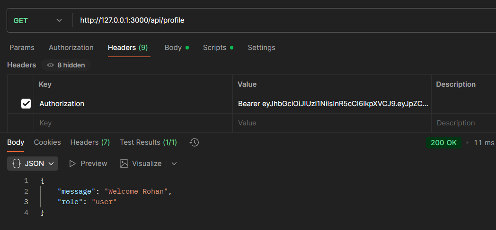
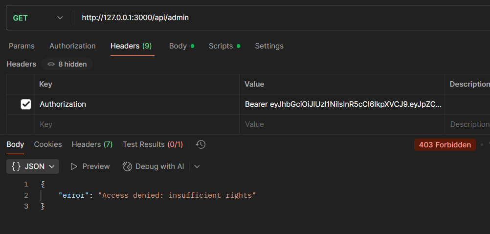

Expected:

- 403 Forbidden when role insufficient.

---

<a id="exp14"></a>

## Experiment 14: Pagination, filtering, and sorting (CO5)

Description: Products route supports page, limit, category filter and sort. Files: routes/products14.js, exp14.js

Run:

- node exp14.js

Example create JSON (POST /api/products)

```json
{
  "name": "Clean Code",
  "category": "books",
  "price": 450
}
```

Example query (GET)

- GET /api/products?page=2&limit=5&category=books&sort=-price

Expected response shape:

```json
{
  "data": [
    /* products */
  ],
  "meta": { "page": 2, "limit": 5, "total": 42 }
}
```

Outputs:
<br></br>
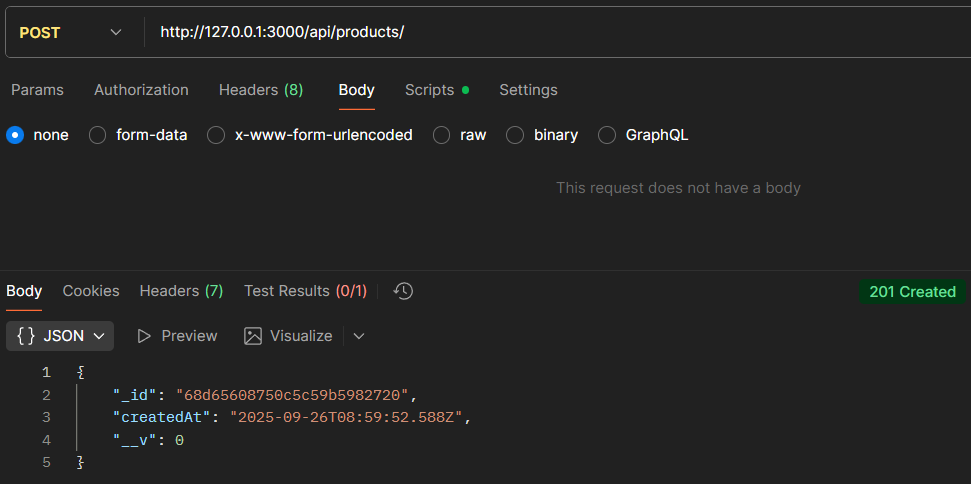
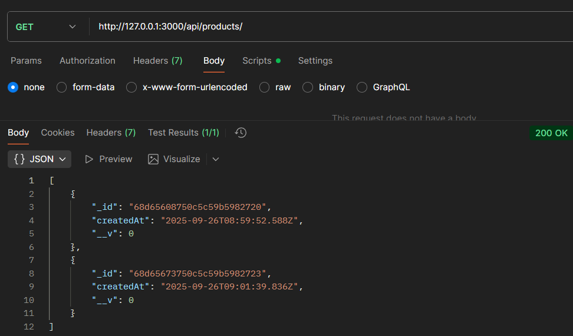

---

<a id="exp15"></a>

## Experiment 15: File upload (Multer) & rate limiting (CO5, CO6)

Description: Multer handles file uploads; express-rate-limit throttles requests. Files: routes/upload.js, exp15.js

Run:

- node exp15.js

Upload example (curl multipart)

```bash
curl -F "file=@/path/to/photo.jpg" http://localhost:3000/api/upload
```

If JSON endpoint exists for metadata, sample:

```json
{ "description": "profile picture" }
```

Outputs:
<br></br>
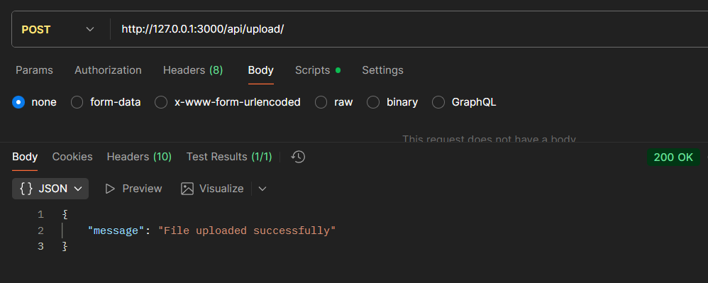
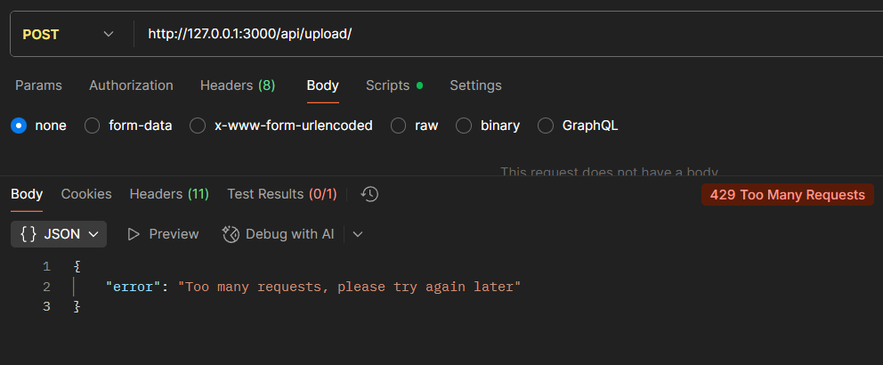

Expected:

- 200/201 on success, 429 when rate limit exceeded.

---